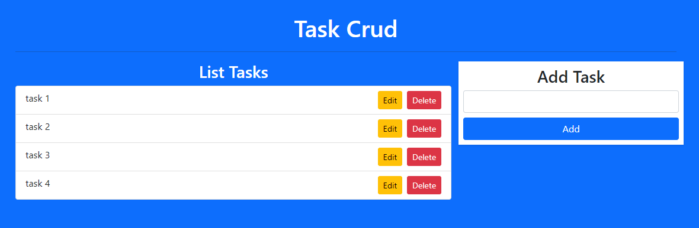
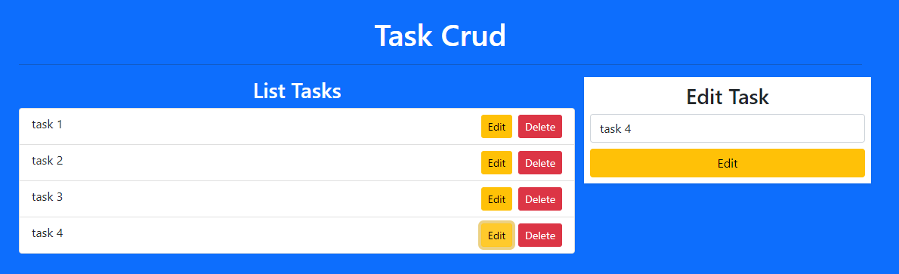

# Task-crud

is a project created with react, in order to learn and share knowledge

## application design

## Available Scripts

In the project directory, you can run:

### `npm start`

Runs the app in the development mode. 
Open [http://localhost:3000](http://localhost:3000) to view it in the browser.

The page will reload if you make edits. 
You will also see any lint errors in the console.
